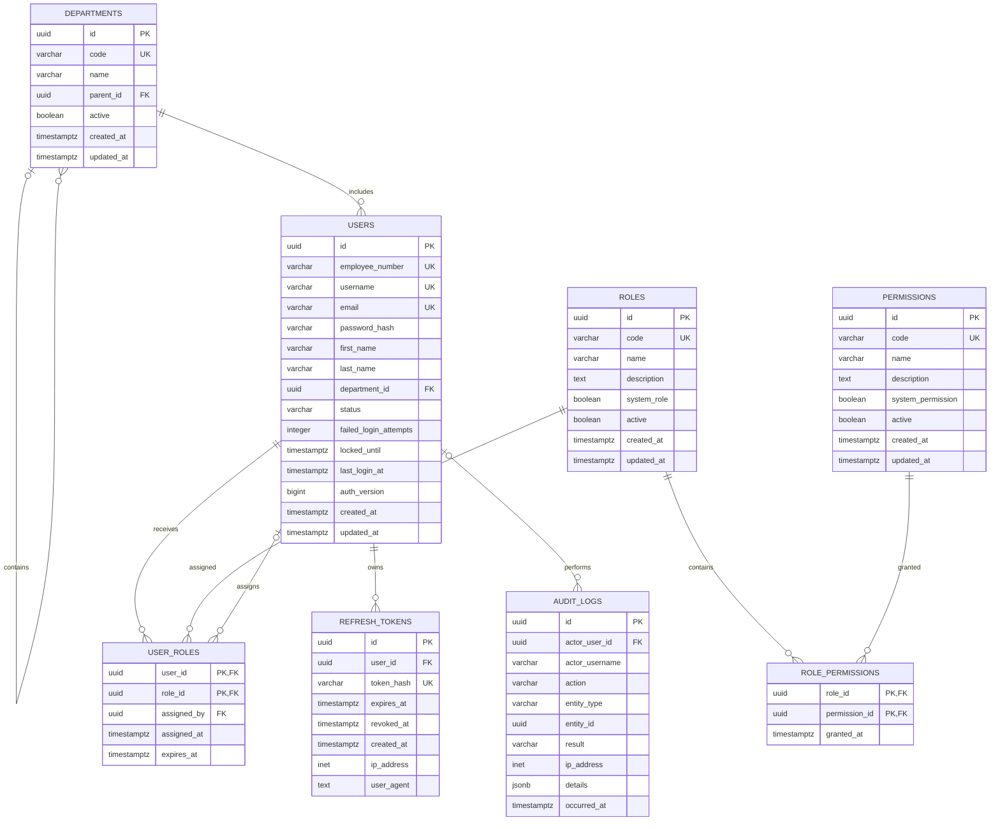

# Database Design

## 1. Overview

This document describes the initial PostgreSQL database schema for the
Bank Identity & Access Management System.

The database supports:

- employee account management;
- bank department management;
- role-based access control;
- role and permission assignments;
- JWT refresh token management;
- security audit logging.

## 2. Main Entities

The first version contains the following tables:

| Table | Purpose |
|---|---|
| `departments` | Stores the organizational structure of the bank. |
| `users` | Stores employee accounts. |
| `roles` | Stores system roles. |
| `permissions` | Stores individual access permissions. |
| `user_roles` | Connects users with roles. |
| `role_permissions` | Connects roles with permissions. |
| `refresh_tokens` | Stores hashed JWT refresh tokens. |
| `audit_logs` | Stores security and administrative events. |

## 3. Entity Relationship Diagram



## 4. Table Definitions

### 4.1 `departments`

Stores bank departments and their hierarchical structure.

| Column | Type | Required | Description |
|---|---|---:|---|
| `id` | `uuid` | Yes | Primary key. |
| `code` | `varchar(50)` | Yes | Unique department code. |
| `name` | `varchar(150)` | Yes | Department name. |
| `parent_id` | `uuid` | No | Parent department identifier. |
| `active` | `boolean` | Yes | Indicates whether the department is active. |
| `created_at` | `timestamptz` | Yes | Creation timestamp. |
| `updated_at` | `timestamptz` | Yes | Last update timestamp. |

A department may contain child departments.

Examples:

- Information Technology;
- Information Security;
- Human Resources;
- Retail Banking;
- Corporate Banking.

### 4.2 `users`

Stores bank employees and their authentication accounts.

| Column | Type | Required | Description |
|---|---|---:|---|
| `id` | `uuid` | Yes | Primary key. |
| `employee_number` | `varchar(50)` | Yes | Unique employee number. |
| `username` | `varchar(100)` | Yes | Unique login name. |
| `email` | `varchar(255)` | Yes | Unique corporate email address. |
| `password_hash` | `varchar(255)` | Yes | Secure password hash. |
| `first_name` | `varchar(100)` | Yes | Employee first name. |
| `last_name` | `varchar(100)` | Yes | Employee last name. |
| `department_id` | `uuid` | Yes | Employee department. |
| `status` | `varchar(20)` | Yes | Current account status. |
| `failed_login_attempts` | `integer` | Yes | Consecutive failed login attempts. |
| `locked_until` | `timestamptz` | No | Temporary account lock expiration. |
| `last_login_at` | `timestamptz` | No | Last successful login. |
| `auth_version` | `bigint` | Yes | Non-negative account authentication epoch. |
| `created_at` | `timestamptz` | Yes | Creation timestamp. |
| `updated_at` | `timestamptz` | Yes | Last update timestamp. |

Supported account statuses:

| Status | Meaning |
|---|---|
| `ACTIVE` | The user may authenticate and use the system. |
| `INACTIVE` | The account was disabled by an administrator. |
| `LOCKED` | The account was locked for security reasons. |

Passwords must never be stored in plain text.

`auth_version` is increased on every account-status transition. An access token
is accepted only while the account is `ACTIVE` and the token claim matches the
current database value. This prevents an old access token from becoming valid
again after account reactivation. Refresh tokens are revoked by administrative
status changes and before an expired automatic lock returns to `ACTIVE`; token
rotation rejects an account while it remains `LOCKED`.

### 4.3 `roles`

Stores roles used by the RBAC authorization model.

Example role codes:

- `ADMIN`;
- `SECURITY_OFFICER`;
- `MANAGER`;
- `AUDITOR`;
- `SUPPORT`.

The `system_role` field identifies built-in roles that cannot be deleted.

### 4.4 `permissions`

Stores individual operations that may be granted to roles.

The `system_permission` field identifies built-in permission codes owned by
the application. System permissions cannot be modified or deactivated through
the API and are always active; custom permissions default to non-system.

Permission codes use the following format:

```text
RESOURCE_ACTION
```

Examples:

- `USER_CREATE`;
- `USER_UPDATE`;
- `USER_VIEW`;
- `USER_DEACTIVATE`;
- `ROLE_CREATE`;
- `ROLE_UPDATE`;
- `ROLE_ASSIGN`;
- `AUDIT_LOG_VIEW`;
- `DEPARTMENT_MANAGE`.

### 4.5 `user_roles`

Implements the many-to-many relationship between users and roles.

The composite primary key is:

```text
(user_id, role_id)
```

The `assigned_by` column identifies the user who assigned the role.

The optional `expires_at` column supports temporary role assignments.

### 4.6 `role_permissions`

Implements the many-to-many relationship between roles and permissions.

The composite primary key is:

```text
(role_id, permission_id)
```

### 4.7 `refresh_tokens`

Stores hashed JWT refresh tokens.

The original refresh token must never be stored in plain text.

A refresh token becomes unusable when:

- its expiration time has passed;
- `revoked_at` is not null;
- the related user account is not active.

### 4.8 `audit_logs`

Stores important authentication, authorization and administrative events.

Example actions:

- `LOGIN_SUCCESS`;
- `LOGIN_FAILURE`;
- `LOGOUT`;
- `USER_CREATED`;
- `USER_UPDATED`;
- `USER_DEACTIVATED`;
- `ROLE_CREATED`;
- `ROLE_ASSIGNED`;
- `ROLE_REMOVED`;
- `PERMISSION_GRANTED`.

The `details` column uses PostgreSQL `jsonb` for structured event data.

Audit records are append-only and must not be edited through the application.

## 5. Unique Constraints

The following values must be unique:

- `departments.code`;
- `users.employee_number`;
- `users.username`;
- `users.email`;
- `roles.code`;
- `permissions.code`;
- `refresh_tokens.token_hash`.

## 6. Foreign Keys

| Source column | Target column |
|---|---|
| `departments.parent_id` | `departments.id` |
| `users.department_id` | `departments.id` |
| `user_roles.user_id` | `users.id` |
| `user_roles.role_id` | `roles.id` |
| `user_roles.assigned_by` | `users.id` |
| `role_permissions.role_id` | `roles.id` |
| `role_permissions.permission_id` | `permissions.id` |
| `refresh_tokens.user_id` | `users.id` |
| `audit_logs.actor_user_id` | `users.id` |

## 7. Planned Indexes

The initial database migration should contain the following indexes:

- `idx_users_department_id`;
- `idx_users_status`;
- `idx_user_roles_role_id`;
- `idx_refresh_tokens_user_id`;
- `idx_refresh_tokens_expires_at`;
- `idx_audit_logs_actor_user_id`;
- `idx_audit_logs_occurred_at`;
- `idx_audit_logs_entity_type_entity_id`;
- `idx_audit_logs_action`.

## 8. Data Deletion Policy

- Users are deactivated by changing their status to `INACTIVE`.
- Departments, roles and permissions are deactivated using `active`.
- Audit logs are not physically deleted by application users.
- Role revocation removes the corresponding row from `user_roles`.
- Permission revocation removes the corresponding row from
  `role_permissions`.
- Expired refresh tokens may be physically deleted after the retention period.

## 9. Migration and Deployment Note

Migration `V4__invalidate_account_sessions.sql` introduces `auth_version` and
revokes every active, unexpired refresh token created by older application
versions. Applying V4 therefore requires all users to log in again. Deploy it
as a coordinated cutover with old application instances stopped; an old
instance does not understand the new access-token claim and must not keep
issuing tokens after the migration.

## 10. Future Extensions

The following features are outside the first version:

- access request workflows;
- multi-stage approval;
- permission delegation;
- external identity providers;
- banking customers and accounts;
- microservices.

They may be added after the initial RBAC system is operational.
